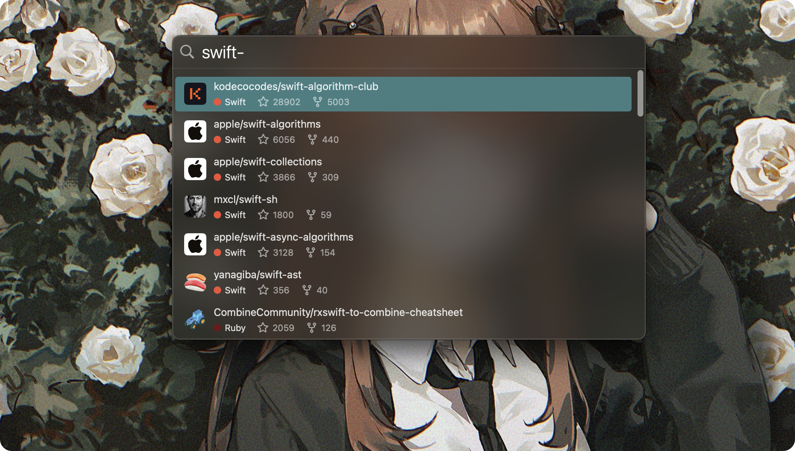

# StarLight

Search GitHub starred repositories like using Spotlight.

## Signing in

StarLight authenticates with GitHub using the OAuth **Device Flow**. When you launch the app for the first time and click *Sign in with GitHub*, the app shows a short user code, copies it to your clipboard, and opens [github.com/login/device](https://github.com/login/device) in your browser. Paste the code on that page to grant access.

The Device Flow does not require a client secret to be shipped inside the app, so:

- StarLight can be used on as many devices as you like without each new login knocking the previous device offline.
- To revoke access at any time, open *Settings → Manage Authorizations on GitHub*, or visit [github.com/settings/applications](https://github.com/settings/applications).

