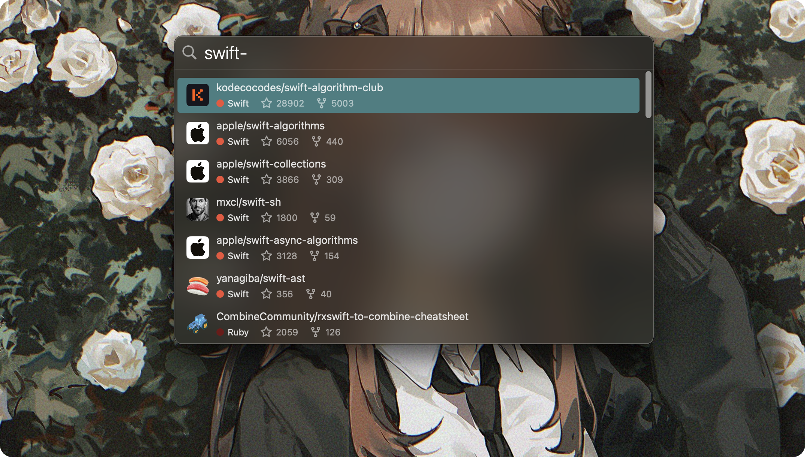

# StarLight

Search your GitHub repositories like using Spotlight.



StarLight lives in your menu bar. Press a global shortcut anywhere, type a few characters, and open
or copy any repository you have starred, own, or share with one of your organizations — without
leaving the keyboard or waiting on the network.

## Features

- **Spotlight-style search panel** — summoned by a global keyboard shortcut you choose.
- **Three sources in one list** — repositories you starred, repositories you own, and every
  repository under the organizations you belong to, deduplicated into a single result list.
- **Search across every field** — repository name, `owner/repo`, description, language, and topics.
  Multi-word queries match when every word hits at least one field.
- **Works offline** — both lists are cached on disk and searchable immediately at launch, even
  before the first network round trip finishes.
- **Cheap background refresh** — instead of re-downloading every page on a timer, StarLight probes
  the newest and last pages of your starred list and only re-paginates when the set actually changed
  (or once a day, whichever comes first).
- **Private repositories are opt-in** — off by default, so StarLight only ever asks for read access
  to public data unless you decide otherwise.
- **Pick what Return does** — open the repository URL, copy it, or both.
- **Device Flow sign-in** — no client secret shipped in the app, so signing in on a new Mac does not
  sign out the old one.
- **Menu bar only** — no dock icon unless a window is open.

## Requirements

- macOS 13.0 or later
- A GitHub account. By default StarLight requests the `read:user` and `public_repo` scopes; turning
  on *Include Private Repositories* asks for `read:user`, `repo`, and `read:org` instead.

## Install

**Download a build.** Grab `StarLight-<version>.zip` from the
[latest release](https://github.com/Mx-Iris/StarLight/releases/latest). Releases are signed with a
Developer ID certificate and notarized by Apple, so they open without a Gatekeeper prompt.

**Or build from source.** Xcode 16 or later is recommended:

```bash
git clone https://github.com/Mx-Iris/StarLight.git
cd StarLight
open StarLight.xcworkspace   # open the workspace, not the .xcodeproj
```

Pick the `StarLight` scheme and run. Dependencies resolve through Swift Package Manager on first
build.

## Usage

1. **Set a shortcut.** Open *Settings* from the menu bar icon and record a hotkey next to
   *StarLight Hotkeys*.
2. **Search.** Press the hotkey from any app, type part of a repository name, description, language,
   or topic, and press Return to trigger your chosen action. Press the hotkey again — or Escape — to
   dismiss the panel.
3. **Menu bar menu.** Click the star icon for *Show Main Window*, *Settings…*, *Refresh* (forces a
   full re-fetch of both lists), and *Quit*. The icon turns into a spinner while a refresh is
   running.

### Settings

| Setting | What it does |
|---------|--------------|
| StarLight Hotkeys | The global shortcut that opens the search panel |
| Show Repository Description | Show each repository's description in the result row |
| Show Settings on Launch | Open the settings window on launch instead of starting menu-bar-only |
| Launch at login | Start StarLight automatically when you log in |
| Repositories Refresh Interval | Minutes between background refresh checks (default 15) |
| Width / Height | Size of the search panel |
| Main Action | What Return does: open the URL, copy it, or both |
| Search My Repositories | Also search repositories you own and everything under your organizations (default on) |
| Include Private Repositories | Include private repositories in the results (default off; requires signing in again) |

### About private repositories

GitHub publishes no read-only OAuth scope for private repositories. The narrowest scope that can
read them is `repo`, which also grants write access, so StarLight does not request it unless you
turn *Include Private Repositories* on. Doing so also requests `read:org`, which is what lets
StarLight see organizations whose membership you have kept private.

StarLight only ever reads. If you would rather not grant the wider scope, leave the toggle off and
the app keeps working across your public repositories.

Turning the toggle back off hides private repositories from search immediately, but it does not
revoke the grant or delete the cache on disk. To revoke it, use *Settings → Manage Authorizations on
GitHub*.

## Signing in

StarLight authenticates with GitHub using the OAuth **Device Flow**. When you launch the app for the
first time and click *Sign in with GitHub*, the app shows a short user code, copies it to your
clipboard, and opens [github.com/login/device](https://github.com/login/device) in your browser.
Paste the code on that page to grant access.

The Device Flow does not require a client secret to be shipped inside the app, so:

- StarLight can be used on as many devices as you like without each new login knocking the previous
  device offline.
- When signed out, protected menu commands and the global keyboard shortcut open the sign-in window
  instead of presenting authenticated content.
- To revoke access at any time, open *Settings → Manage Authorizations on GitHub*, or visit
  [github.com/settings/applications](https://github.com/settings/applications).

Your access token is stored in the local login keychain with iCloud sync explicitly disabled — it
never leaves the Mac it was created on. If GitHub ever rejects the token, StarLight clears it,
closes the authenticated windows, and reopens the sign-in window with an explanation.

## Where data lives

| Path | Contents |
|------|----------|
| `~/Documents/StarredRepositories.json` | The cached starred repository list |
| `~/Documents/StarredRepositoriesMetadata.json` | Which account the cache belongs to, and when the last full refresh ran |
| `~/Documents/PersonalRepositories.json` | The cached list of your own and your organizations' repositories |
| `~/Documents/PersonalRepositoriesMetadata.json` | The same metadata for that list |
| Login keychain, service `com.JH.StarLight.Keychains` | The GitHub access token |

These caches hold repository metadata — names, descriptions, topics — as plain JSON. With *Include
Private Repositories* on, that covers your private repositories too. Repository contents are never
downloaded.

Upgrading from 1.7 or earlier renames the two starred cache files, which happens automatically on
first launch and does not cost you a full re-fetch.

## Project layout

| Path | Description |
|------|-------------|
| `StarLight/` | The app: AppKit coordinators, window controllers, and SwiftUI views |
| `Components/` | Local Swift package — `StarLightCore`, `StarLightUI`, `StarLightUtilities`, `StarLightResources` |
| `Documentations/` | Design and evolution notes ([index](Documentations/README.md)) |
| `ReleaseNotes/` | One file per release tag, used verbatim as the GitHub Release body |
| `scripts/`, `.github/workflows/` | The signed-and-notarized release pipeline |

Contributors and coding agents should start with [`AGENTS.md`](AGENTS.md), which documents the
architecture, build commands, and repository conventions in one place.
